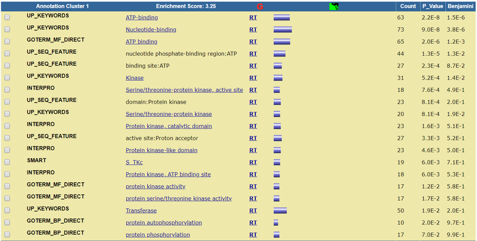
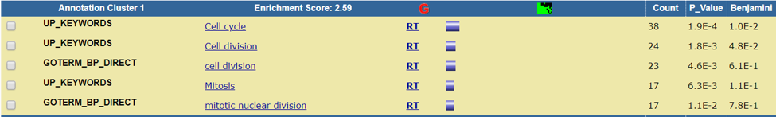

```{r setup, include=FALSE}
knitr::opts_chunk$set(echo = TRUE)
```

## Introduction

The data used for this analysis is associated with the paper titled "Targetting tumor cell plasticity by combined inhibition of NOTCH and MAPK signaling in colon cancer" by Scmidt et. al. [@schmidt2018targeting]. This experiment was done using three biological replicates of xenografts that were treated with a control, AZD  (MEK inhibitor selumetinib) or DBZ (γ-secretase inhibitor dibenzazepine). The goal was to evaluate the effects of those treatments on the signalling pathways. [The data can be found here.](https://www.ncbi.nlm.nih.gov/geo/query/acc.cgi?acc=GSE98922)  
Following the lecture slides found [here](https://risserlin.github.io/BCB420-lectures-public/lecture6_annotation_resources_and_prelim_ORA.html) as well as [this tutorial](https://bioinformatics-core-shared-training.github.io/RNAseq-R/rna-seq-de.nb.html) I performed a differential gene expression analysis and a thresholded over-representation analysis on the dataset using R and David respectively.

## Differental Gene Expression Analysis

First I needed to load the libraries required.

```{r}
library(GEOquery)
library(edgeR)
library(biomaRt)
```

Then, load the data and read it. 

```{r}
#Load the data
sfiles = getGEOSuppFiles('GSE98922')

fnames = rownames(sfiles)

#Read the file
exp = read.delim(fnames[1],header = TRUE,check.names = FALSE)
```

Once we have the data the next step is filtering out those with low read counts.

```{r}
#Get rid of low counts
cpms <- edgeR:: cpm(exp[,2:10])
rownames(cpms) <- exp[,1]
keep = rowSums(cpms > 1) >= 3
exp_filtered = exp[keep,]
rownames(exp_filtered) <- rownames(cpms[keep,])

filtered_data_matrix <- as.matrix(exp_filtered[,2:10])
rownames(filtered_data_matrix) <- rownames(exp_filtered)
filtered_data_matrix
```

The samples are split based on treatment and trial number.  There are three treatments control, treatment A (AZD), and treatment D (DBZ). Each of these has 3 trials.

```{r}
#Separate into groups
samples <- data.frame(c('control', '1'), c('control', '2'), c('control', '3'), c('treatmentA', '1'), c('treatmentA', '2'), c('treatmentA', '3'), c('treatmentD', '1'), c('treatmentD', '2'), c('treatmentD', '3'))
rownames(samples) <- c("treatment", "trial")
colnames(samples) <- colnames(exp_filtered)[2:10]
samples <- data.frame(t(samples))
```


With all the information needed we can now estimate the dispersal.

```{r}
d = DGEList(counts = filtered_data_matrix, group = samples$treatment)

#Create model
model_design_pat <- model.matrix(~ samples$treatment + samples$trial)

#Estimate dispersion
d <- estimateDisp(d, model_design_pat)

#Calculate normalization factors
d <- calcNormFactors(d)

#fit model
fit <- glmQLFit(d, model_design_pat)

#calculate differential expression
qlf.pos_vs_neg <- glmQLFTest(fit)


qlf_output_hits <- topTags(qlf.pos_vs_neg, sort.by = "PValue", n = nrow(filtered_data_matrix))
```

Now we can look at the results.

```{r}
#How many genes pass the threshold p-value < 0.05?
length(which(qlf_output_hits$table$PValue < 0.05))
#1131

#How many genes pass correction?
length(which(qlf_output_hits$table$FDR < 0.05))
#0

#How many genes are up regulated?
length(which(qlf_output_hits$table$PValue < 0.05 & qlf_output_hits$table$logFC > 0))
#660

#How many genes are down regulated?
length(which(qlf_output_hits$table$PValue < 0.05 & qlf_output_hits$table$logFC < 0))
#471
```
## Thresholded over-representation analysis
Below we are creating the thresholded lists of genes and writing them to files for use by David.
```{r}
#Create thresholded lists of gene
qlf_output_hits_withgn <- merge(exp[,1:2], qlf_output_hits, by.x = 1, by.y = 0)
qlf_output_hits_withgn[,"rank"] <- - log(qlf_output_hits_withgn$PValue, base = 10) * sign(qlf_output_hits_withgn$logFC)
qlf_output_hits_withgn <- qlf_output_hits_withgn[order(qlf_output_hits_withgn$rank),]
upregulated_genes <- qlf_output_hits_withgn$Var.1[which(qlf_output_hits_withgn$PValue < 0.05 & qlf_output_hits_withgn$logFC > 0)]
upregulated_genes
downregulated_genes <- qlf_output_hits_withgn$Var.1[which(qlf_output_hits_withgn$PValue < 0.05 & qlf_output_hits_withgn$logFC < 0)]

write.table(x=upregulated_genes, file=file.path("data", "upregulated_genes.txt"), sep = "\t", row.names = FALSE, col.names = FALSE, quote = FALSE)

write.table(x=downregulated_genes, file=file.path("data", "downregulated_genes.txt"), sep = "\t", row.names = FALSE, col.names = FALSE, quote = FALSE)
```
Plotting these we get the following.
```{r, echo = FALSE}
#Plot
par(mar=c(1,1,1,1))

dObj <- calcNormFactors(d)
dObj <- calcNormFactors(dObj)
dObj <- estimateCommonDisp(dObj)
dObj <- estimateGLMTrendedDisp(dObj)
dObj <- estimateTagwiseDisp(dObj)
plotBCV(dObj, xlab = "Average log CPM", ylab = "Biological coefficient of variation")
plot(qlf_output_hits_withgn$logFC, -log10(qlf_output_hits_withgn$PValue), xlab = "LogFC", ylab = "- log10(PValue)")
```

I chose to use David 6.8 as it has many tutorials and is easy to use [@sherman2009systematic]. This was done by using the Gene Annotation function with the upregulated and down regulated sets of genes.



When comparing upregulated and downregulated genes it appears that the downregulated genes have a higher enrichment.  Above you can see two tables of the same Annotation cluster for both, which had the highest enrichment score total.
