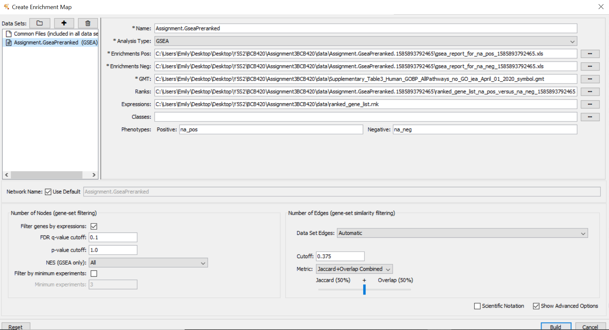
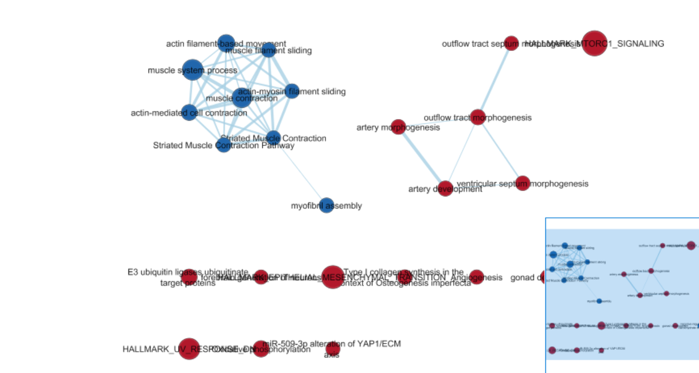
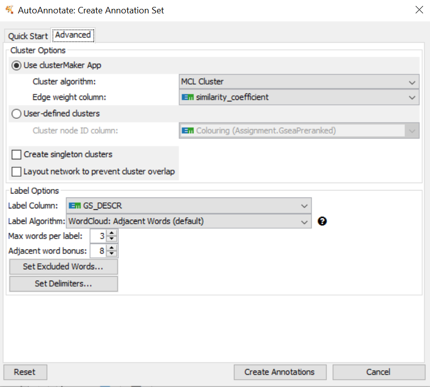
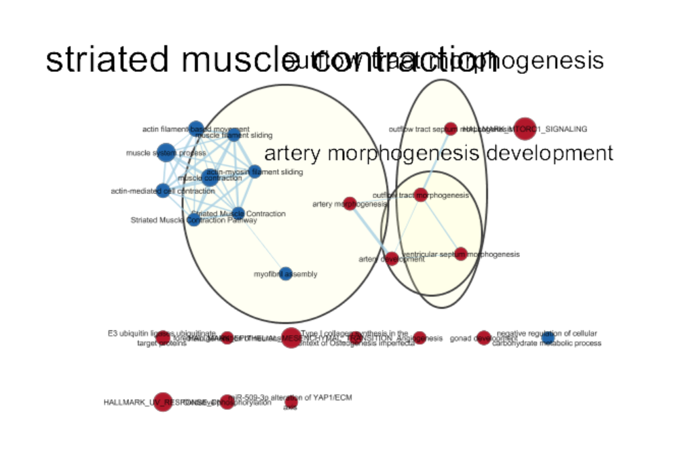
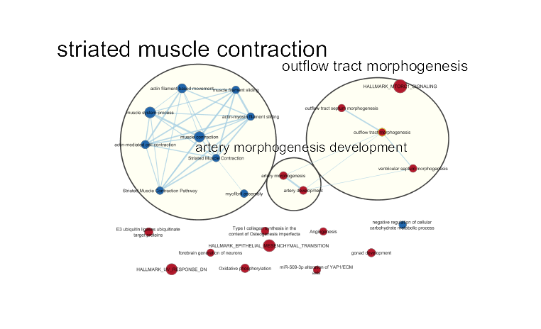
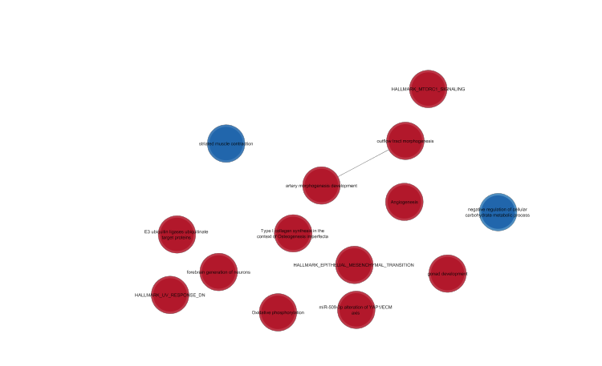
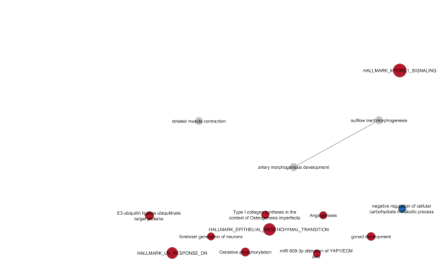

```{r setup, include=FALSE}
knitr::opts_chunk$set(echo = TRUE)
```

## Introduction

The data used for this analysis is from Schmidt et Al. 2018, the publication is titled *Targeting tumor cell plasticity by combined inhibition of NOTCH and MAPK signaling in colon cancer* [@schmidt2018targeting].  They investigated the effects that tarketting NOTCH and MAPK signalling had on colon cancer. They analyzed gene expression after AZD or DBZ treatment and found opposing offects of MAPK and NOTCH repression on EMT.[@schmidt2018targeting]  The datasource and links to the paper can be found [here](https://www.ncbi.nlm.nih.gov/geo/query/acc.cgi?acc=GSE98922). The data comes in three groups: Control, Treatment A (AZD), and Treatment D (DBZ).  

![*Figure 1* Shows the results from the expression analysis done by Schmidt et Al. Reprinted from "Targeting tumor cell plasticity by combined inhibition of NOTCH and MAPK signaling in colon cancer [@schmidt2018targeting]](Figure 4.jpg)

First it is required that we install and load all the required libraries.

## Set Up

```{r}
if(!requireNamespace("GEOquery", quietly = TRUE))
  install.packages("GEOquery")
if(!requireNamespace("edgeR", quietly = TRUE))
  install.packages("edgeR")
if(!requireNamespace("biomaRt", quietly = TRUE))
  install.packages("biomaRt")
if(!requireNamespace("GEOquery", quietly = TRUE))
  install.packages("GEOquery")
if(!requireNamespace("tidyr", quietly = TRUE))
  install.packages("tidyr")

library(GEOquery)
library(edgeR)
library(biomaRt)
library(tidyr)
```
[@GEOquery][@edgeR1][@edgeR2][@biomaRt1][@biomaRt2][@tidyr]

## Previously Done Work

This work was done for Assignment 2 and loads, filters and names the data ultimately producing a list of genes with symbols and ranks.

```{r}
#The following code is copied from previous assignments done by me(Emily Ayala)
#for the course BCB420.  This code was also copied from lecture slides written by Ruth Isserlin
#Load the data
sfiles = getGEOSuppFiles('GSE98922')

fnames = rownames(sfiles)

#Read the file
exp = read.delim(fnames[1],header = TRUE,check.names = FALSE)

#Get rid of low counts
cpms <- edgeR:: cpm(exp[,2:10])
rownames(cpms) <- exp[,1]
keep = rowSums(cpms > 1) >= 3
exp_filtered = exp[keep,]
rownames(exp_filtered) <- rownames(cpms[keep,])

filtered_data_matrix <- as.matrix(exp_filtered[,2:10])
rownames(filtered_data_matrix) <- rownames(exp_filtered)

#Separate into groups
samples <- data.frame(c('control', '1'), c('control', '2'), c('control', '3'), c('treatmentA', '1'), c('treatmentA', '2'), c('treatmentA', '3'), c('treatmentD', '1'), c('treatmentD', '2'), c('treatmentD', '3'))
rownames(samples) <- c("treatment", "trial")
colnames(samples) <- colnames(exp_filtered)[2:10]
samples <- data.frame(t(samples))

d <- DGEList(counts = filtered_data_matrix, group = samples$treatment)

#Create model
model_design_pat <- model.matrix(~ samples$treatment + samples$trial)

#Estimate dispersion
d <- estimateDisp(d, model_design_pat)

#Calculate normalization factors
d <- calcNormFactors(d)

#fit model
fit <- glmQLFit(d, model_design_pat)

#calculate differential expression
qlf.pos_vs_neg <- glmQLFTest(fit)

qlf_output_hits <- topTags(qlf.pos_vs_neg, sort.by = "PValue", n = nrow(filtered_data_matrix))

#Create thresholded lists of gene
qlf_output_hits_withgn <- merge(exp[,1:2], qlf_output_hits, by.x = 1, by.y = 0)
qlf_output_hits_withgn[,"rank"] <- - log(qlf_output_hits_withgn$PValue, base = 10) * sign(qlf_output_hits_withgn$logFC)
qlf_output_hits_withgn <- qlf_output_hits_withgn[order(qlf_output_hits_withgn$rank),]

#Make a ranked genelist
ranked_list <- data.frame(symbol = qlf_output_hits_withgn$Var.1, rank = qlf_output_hits_withgn$rank)

#Write that ranked list to a file
write.table(x=ranked_list, file=file.path("data", "ranked_gene_list.rnk"), sep = "\t", row.names = FALSE, col.names = TRUE, quote = FALSE)
```

## Running GSEA from within R

I copied the code for running GSEA through R written by Ruth Isserlin [@EnrichmentMapProtocol] and modified parameters for my specific situation.

First is the package requirements:

```{r}
#The following is copied from Enrichment Map Analysis Pipeline by Ruth Isserlin 2019-11-18 
#https://baderlab.github.io/Cytoscape_workflows/EnrichmentMapPipeline/Protocol2_createEM.html#1_materials
#install required R and bioconductor packages
tryCatch(expr = { library("RCurl")}, 
         error = function(e) {  install.packages("RCurl")}, 
         finally = library("RCurl"))

#use library
tryCatch(expr = { library("limma")}, 
         error = function(e) { source("https://bioconductor.org/biocLite.R")
           biocLite("limma")}, 
         finally = library("limma"))
tryCatch(expr = { library("Biobase")}, 
         error = function(e) { source("https://bioconductor.org/biocLite.R")
           biocLite("Biobase")}, 
         finally = library("Biobase"))
tryCatch(expr = { library("ggplot2")}, 
         error = function(e) { install.packages("ggplot2")}, 
         finally = library("ggplot2"))

```

The paths to the GSEA file and the working directory need to be set in parameters.txt.  The first line should be the path to the GSEA .bat file (assuming a windows system).  The second line should be the path to the working directory.

Read in the paths and set varaibles:
```{r}
parameters <- read.table("parameters.txt", header = FALSE, sep = "", dec = ".", stringsAsFactors = FALSE)

gsea_jar <- parameters$V1[1] 
java_version <- 11
working_dir <- parameters$V1[2]

analysis_name <- "Assignment 3"
rnk_file <- "ranked_gene_list.rnk"
```

Connect and download the most recent pathway definition file.

```{r}
#Download the latest pathway definition file
gmt_url = "http://download.baderlab.org/EM_Genesets/current_release/Human/symbol/"

filenames = getURL(gmt_url)
tc = textConnection(filenames)
contents = readLines(tc)
close(tc)

rx = gregexpr("(?<=<a href=\")(.*.GOBP_AllPathways_no_GO_iea.*.)(.gmt)(?=\">)",
              contents, perl = TRUE)
gmt_file = unlist(regmatches(contents, rx))

dest_gmt_file <- file.path(working_dir,paste("Supplementary_Table3_",gmt_file,sep="") )

download.file(
  paste(gmt_url,gmt_file,sep=""),
  destfile=dest_gmt_file
)
```

Create and runt the command to run GSEA.

```{r}
#Create a command to run
command <- paste("", gsea_jar, "GSEAPreRanked -gmx", dest_gmt_file, "-rnk", file.path(working_dir, rnk_file), "-collapse false -nperm 1000 -scoring_scheme weighted -rpt_label ", analysis_name, "-plot_top_x 20 -rnd_seed 54321 -set_max 200 -set_min 15 -zip_report false -out" ,working_dir, "> gsea_output", sep = " ")

system(command)
```

For this I used GSEA Version 4.0.2 [@subramanian2005gene] with java version 11 and GOBP_AllPathways_no_GO_iea_April_01_2020_symbol.gmt found [here](http://download.baderlab.org/EM_Genesets/current_release/Human/symbol/).

The files are found in the output folder from the GSEA.

I find the comparison to the analysis done in assignment 2 to not be straight forward.  For Assignment 3 I have Gene-sets each with a ES, for Assignment 2 the program I used doesn't give something comparable to be able to really see a clear comparison.

## Visualize your Gene set Enrichment Analysis

The Enrichment map was created manually using Cystoscape v3.7.2 [@shannon2003cytoscape].

The following parameters were used to create the initial map and produced the result shown in Figure 3.





Annotation was done using AutoAnnotate with the fields filled in as shown below.



It was done using the MCL Cluster algorithm which produces the following result.



As this is very hard to read it was spread out to make the labels more readable.



I also have a Summary Network with both the clustered and the unclustered nodes.



As well as the very simillar map created by selecting collapse all.



It is not a very extensive network with many genesets not connected or clustered. This is expecially evident in the last two figures.


